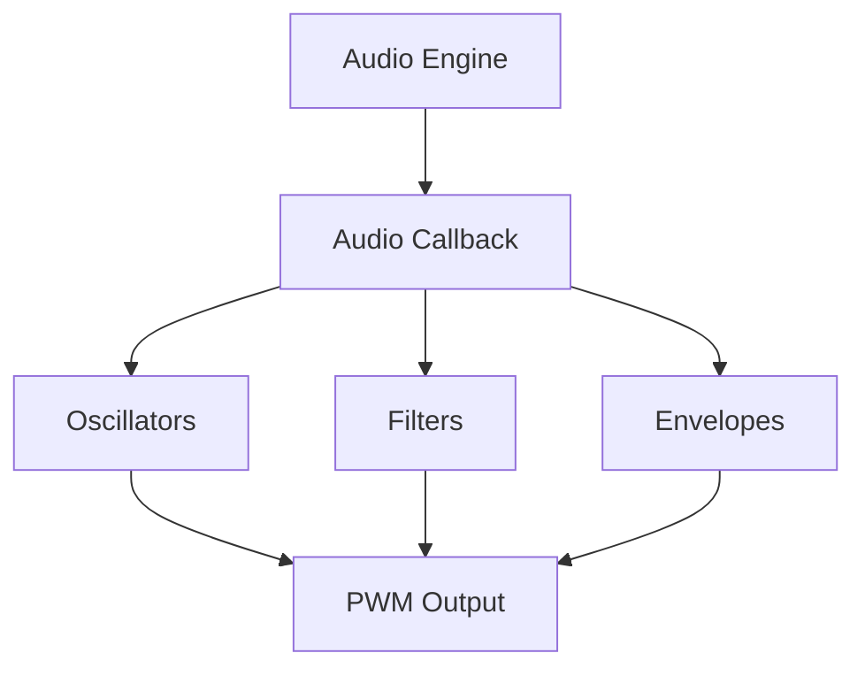

# API Reference

Complete API documentation for KoeKit audio synthesis library.

## Overview

KoeKit provides a comprehensive set of classes and functions for real-time audio synthesis on RP2350A microcontrollers. The API is designed to be both powerful and easy to use, following Arduino conventions where possible.

## Core Architecture



## Quick Reference

### Essential Functions
```cpp
// Initialize audio system
bool KoeKit::begin(uint32_t sample_rate = 22050, uint8_t output_pin = 1);

// Set audio processing callback
void KoeKit::setAudioCallback(AudioCallback callback);

// Stop audio system
void KoeKit::end();
```

### Core Classes
```cpp
// Oscillators
KoeKit::Oscillator osc(wavetable);
KoeKit::NoiseGenerator noise;

// Filters  
KoeKit::Filter::OnePole filter;
KoeKit::Filter::StateVariable svf;
KoeKit::Filter::Biquad biquad;

// Envelopes
KoeKit::Envelope::ADSR envelope;
KoeKit::Envelope::AR percussive;
KoeKit::Envelope::LFO lfo;
```

### Common Usage Pattern

```cpp
#include <KoeKit.h>

// Declare audio components
KoeKit::Oscillator osc(KoeKit::Wavetables::Basic::SINE);
KoeKit::Filter::OnePole filter;
KoeKit::Envelope::ADSR env;

void setup() {
  // Initialize
  KoeKit::begin(22050, 1);
  
  // Configure components
  osc.setFrequency(440.0f);
  filter.setCutoff(1000.0f);
  env.setADSR(0.01f, 0.1f, 0.7f, 0.3f);
  
  // Set audio callback
  KoeKit::setAudioCallback([]() -> float {
    float sample = osc.process();
    sample = filter.processLPF(sample);
    return env.process(sample);
  });
}
```

## API Sections

### [Core Classes](/api/core-classes)
AudioEngine, PWMAudioOutput, and global functions for system management.

### [Oscillators](/api/oscillators)  
Wavetable oscillators, noise generators, and phase management.

### [Filters](/api/filters)
OnePole, StateVariable, Biquad, and DCBlocker filter implementations.

### [Envelopes](/api/envelopes)
ADSR, AR envelopes, and LFO modulators for dynamic control.

### [Wavetables](/api/wavetables)
Wavetable creation, built-in waveforms, and custom wavetable generation.

### [Global Functions](/api/global-functions)
Utility functions and system-wide controls.

## Performance Guidelines

### Memory Usage
- Each oscillator: ~50 bytes
- Each filter: ~20-40 bytes  
- Each envelope: ~30 bytes
- Basic wavetables: 12KB total

### CPU Usage (at 22kHz)
- Oscillator: ~1% per instance
- OnePole filter: ~0.5% per instance
- StateVariable filter: ~1% per instance
- ADSR envelope: ~0.5% per instance

### Best Practices

::: tip Optimization Tips
- Pre-allocate objects in global scope
- Use `constexpr` for wavetables
- Avoid dynamic memory allocation in audio callback
- Keep audio callback lean and fast
:::

::: warning Performance Limits
- Target <20% total CPU usage
- Limit simultaneous voices based on complexity
- Monitor memory usage on complex projects
:::

## Error Handling

KoeKit uses safe parameter clamping rather than exceptions:

```cpp
// Parameters are automatically clamped to safe ranges
osc.setFrequency(-100.0f);  // Clamped to minimum safe value
filter.setCutoff(100000.0f); // Clamped to Nyquist limit
env.setAttack(-1.0f);       // Clamped to minimum time
```

Always check return values for initialization functions:

```cpp
if (!KoeKit::begin(22050, 1)) {
  Serial.println("Audio initialization failed!");
  // Handle error appropriately
}
```

## Thread Safety

::: warning Thread Safety
KoeKit is **not thread-safe**. All audio components should be accessed from the same core that initialized the audio system.
:::

For dual-core applications:
- Initialize KoeKit on one core
- Access all audio components from that same core
- Use appropriate synchronization for inter-core communication

## Debugging

### Serial Output
Never use `Serial.print()` inside the audio callback - it will cause audio glitches:

```cpp
// ❌ Wrong - will cause audio problems
KoeKit::setAudioCallback([]() -> float {
  Serial.println("Debug info");  // Don't do this!
  return osc.process();
});

// ✅ Correct - debug outside audio callback
void loop() {
  Serial.println("Debug info");  // Safe here
  delay(1000);
}
```

### Performance Monitoring
```cpp
// Monitor audio system health
uint32_t sampleRate = KoeKit::getSampleRate();
bool isActive = KoeKit::AudioEngine::getInstance().isActive();
```

## Version Compatibility

This documentation covers KoeKit v1.0.0. Check the [changelog](https://github.com/kurogedelic/KoeKit/releases) for version-specific features and breaking changes.

## Next Steps

- Browse the [Core Classes](/api/core-classes) for fundamental system components
- Learn about [Oscillators](/api/oscillators) for audio generation  
- Explore [Filters](/api/filters) for sound shaping
- Master [Envelopes](/api/envelopes) for dynamic control
- Create [Custom Wavetables](/api/wavetables) for unique sounds